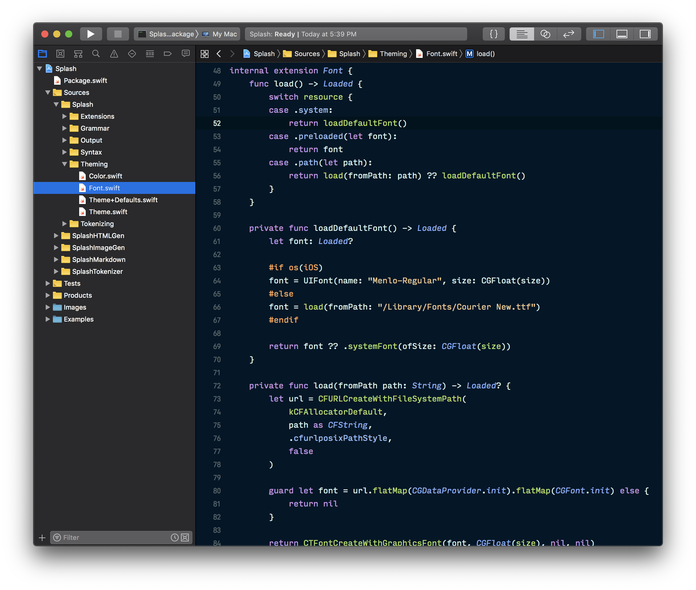
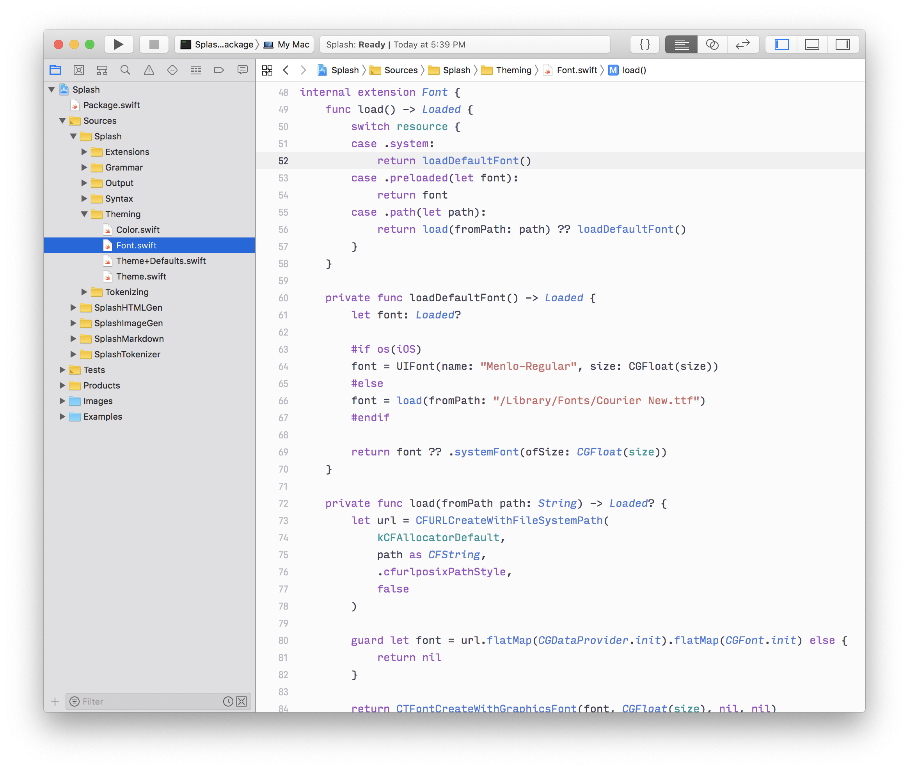

# Night Owl

Night Owl and Light Owl are Xcode themes based on [themes of the same name](https://github.com/sdras/night-owl-vscode-theme) from [Sarah Drasner](https://github.com/sdras).

To install, create a directory at `~/Library/Developer/Xcode/UserData/FontAndColorThemes/` if it does not already exist and copy `Night Owl.xccolortheme` and `Light Owl.xccolortheme` into that directory.

Or use these Bash commands:

```bash
mkdir ~/Library/Developer/Xcode/UserData/FontAndColorThemes/
cp Night Owl.xccolortheme ~/Library/Developer/Xcode/UserData/FontAndColorThemes/
cp Light Owl.xccolortheme ~/Library/Developer/Xcode/UserData/FontAndColorThemes/
```

## 🌌 Night Owl



## 🦉 Light Owl


